<div>
  <h1 align="center"><b>DevSecOps : Netflix Clone CI-CD with Monitoring | Email</b></h1>
  <a href="http://netflix-clone-with-tmdb-using-react-mui.vercel.app/">
    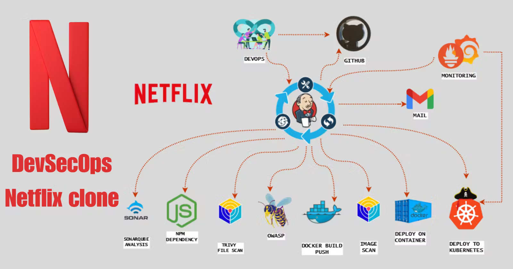
  </a>
  <br /><br />
  <p>
    <b>Hello friends, we will be deploying a Netflix clone. We will use Jenkins as a CI/CD tool and deploy our application in a Docker container and on a Kubernetes cluster. Additionally, we will monitor the Jenkins and Kubernetes metrics using Grafana, Prometheus, and Node Exporter. I hope you find this detailed blog useful.</b>
  </p>
  <h4>
      <b>
        <u>
          <a href="https://github.com/Shravankumar1989/Netflix-clone">
            Click here for the GitHub repository.
          </a>
        </u>
      </b>
  </h4>
  <h4>
    Please follow the steps below.
  </h4>
  <p><b>Step 1 - </b>Launch an Ubuntu (22.04) T2 Large instance.</p>
  <p><b>Step 2 - </b>Install Jenkins, Docker, and Trivy. Create a SonarQube container using Docker.</p>
  <p><b>Step 3 - </b>Create a TMDB API key.</p>
  <p><b>Step 4 - </b>Install Prometheus and Grafana on the new server.</p>
  <p><b>Step 5 - </b>Install the Prometheus plugin and integrate it with the Prometheus server.</p>
  <p><b>Step 6 - </b>Set up email integration with Jenkins and plugin setup.</p>
  <p><b>Step 7 - </b>Install plugins like JDK, SonarQube Scanner, Node.js, and OWASP Dependency Check.</p>
  <p><b>Step 8 - </b>Create a pipeline project in Jenkins using a declarative pipeline.</p>
  <p><b>Step 9 - </b>Install OWASP Dependency Check plugins.</p>
  <p><b>Step 10 - </b>Build and push Docker images.</p>
  <p><b>Step 11 - </b>Deploy the image using Docker.</p>
  <p><b>Step 12 - </b>Set up Kubernetes master and worker on Ubuntu (20.04).</p>
  <p><b>Step 13 - </b>Access the Netflix app in the browser.</p>
  <p><b>Step 14 - </b>Terminate the AWS EC2 instances.</p>
  <h4>
   Now, let's get started and dig deeper into each of these steps:
  </h4>
  <h2><b>Step 1 - Launch an Ubuntu (22.04) T2 Large instance.</b></h2>
  
  <p><b>Launch an AWS T2 Large instance, using Ubuntu as the image. You can either create a new key pair or use an existing one. In the Security Group, enable HTTP and HTTPS settings, and open all ports (although it's not the best practice to open all ports, it's acceptable for learning purposes).</b></p>
  <p>
    
    <br /><br />
    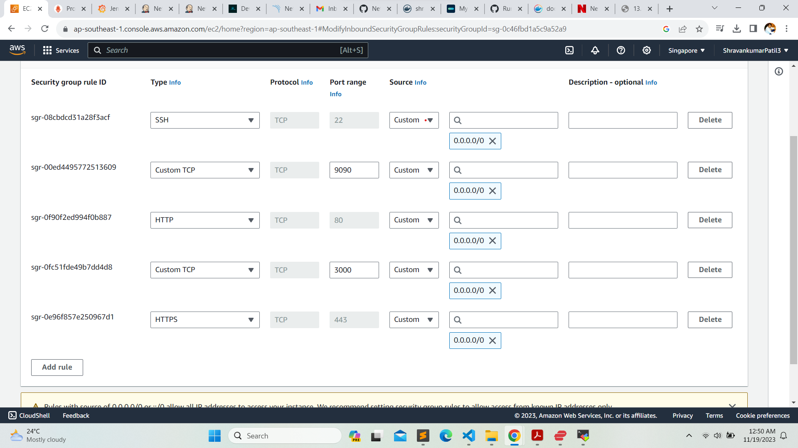
  </p>
  <h2><b>Step 2 - Install Jenkins, Docker, and Trivy. Create a SonarQube container using Docker.</b></h2>
  <h3><b>Step 2.1 - To Install Jenkins</b></h3>
  <p>Connect to your console and enter these commands to install Jenkins.</p>
  

```sh
#Make sure to run as root, or add [the command] to the user data during the EC2 instance launch.

#Create a shell script named jenkins.sh.
vi jenkins.sh

#Add the code below into the jenkins.sh file.

#!/bin/bash
# Update the package list
sudo apt update -y

# The following line is commented out. If uncommented, it would upgrade all packages.
#sudo apt upgrade -y

# Download and add the Adoptium GPG key for package verification
wget -O - https://packages.adoptium.net/artifactory/api/gpg/key/public | sudo tee /etc/apt/keyrings/adoptium.asc

# Add the Adoptium repository to the sources list
echo "deb [signed-by=/etc/apt/keyrings/adoptium.asc] https://packages.adoptium.net/artifactory/deb $(awk -F= '/^VERSION_CODENAME/{print$2}' /etc/os-release) main" | sudo tee /etc/apt/sources.list.d/adoptium.list

# Update the package list again after adding new repository
sudo apt update -y

# Install the Temurin 17 JDK package
sudo apt install temurin-17-jdk -y

# Check the Java version to confirm installation
/usr/bin/java --version

# Download and add the Jenkins GPG key for package verification
curl -fsSL https://pkg.jenkins.io/debian-stable/jenkins.io-2023.key | sudo tee /usr/share/keyrings/jenkins-keyring.asc > /dev/null

# Add the Jenkins repository to the sources list
echo deb [signed-by=/usr/share/keyrings/jenkins-keyring.asc] https://pkg.jenkins.io/debian-stable binary/ | sudo tee /etc/apt/sources.list.d/jenkins.list > /dev/null

# Update the package list again after adding the Jenkins repository
sudo apt-get update -y

# Install Jenkins
sudo apt-get install jenkins -y

# Start the Jenkins service
sudo systemctl start jenkins

# Check the status of the Jenkins service
sudo systemctl status jenkins
```

```sh
# Grant all users read, write, and execute permissions on the jenkins.sh file
sudo chmod 777 jenkins.sh

# Execute the jenkins.sh script
./jenkins.sh
```


<p>Once Jenkins is installed, you will need to go to your AWS EC2 Security Group and open inbound port 8080, as Jenkins operates on this port. <br/>Then, obtain your public IP address.</p>


```sh
<EC2 Instance Public IP Address:8080>
#Example
https://13.229.211.33:8080

# Display the initial admin password for Jenkins, stored in the specified file
sudo cat /var/lib/jenkins/secrets/initialAdminPassword
```


<p>
    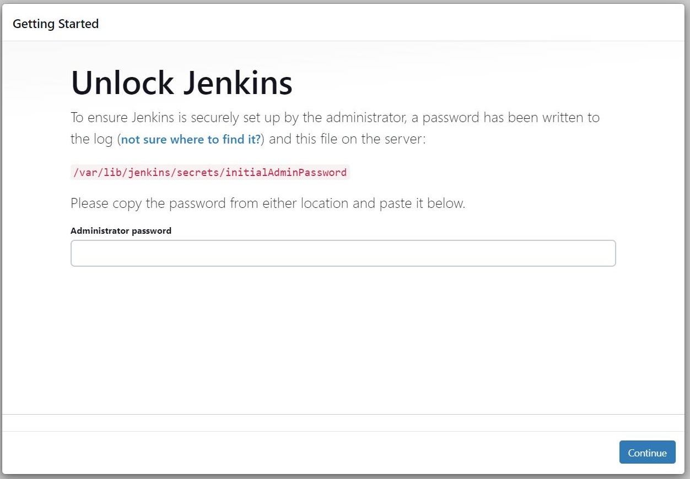
    <p>Unlock Jenkins using an administrative password and install the suggested plugins.</p>
    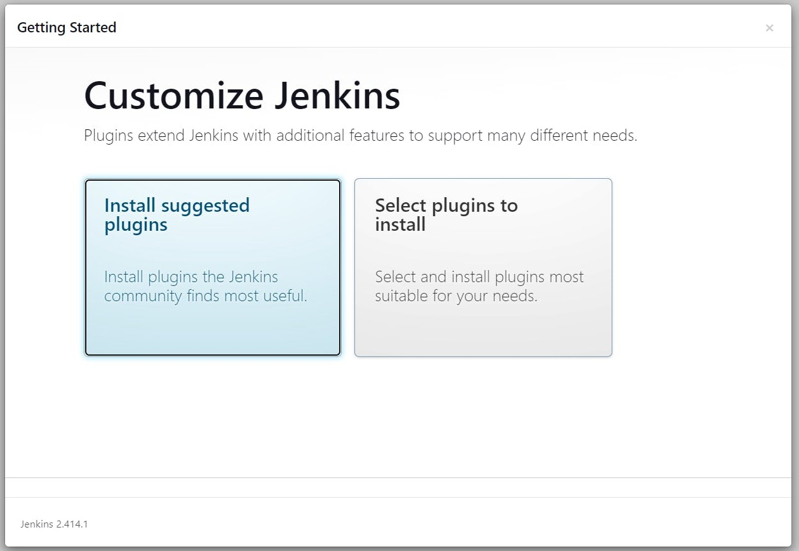
    <p>Jenkins will now be installed, along with all the necessary libraries.</p>
    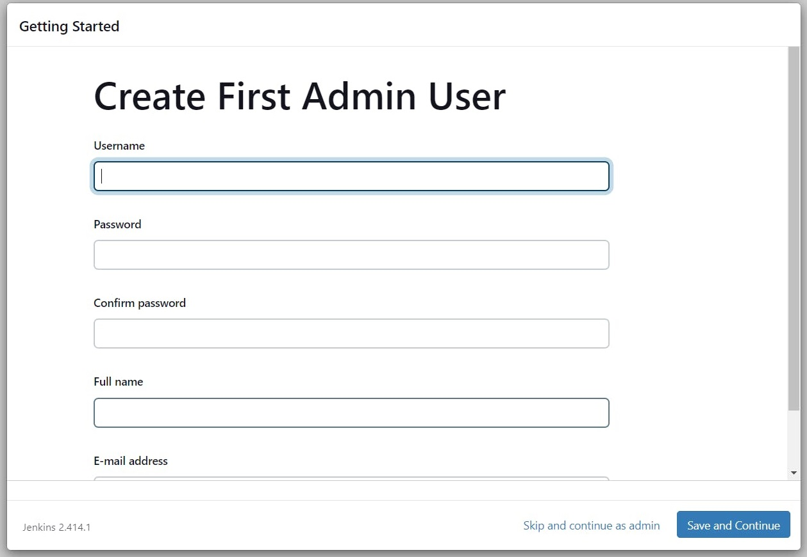
    <p>Create a user, then click on 'Save and Continue.'</p>
    <p>This is the Jenkins Getting Started Screen.</p>
    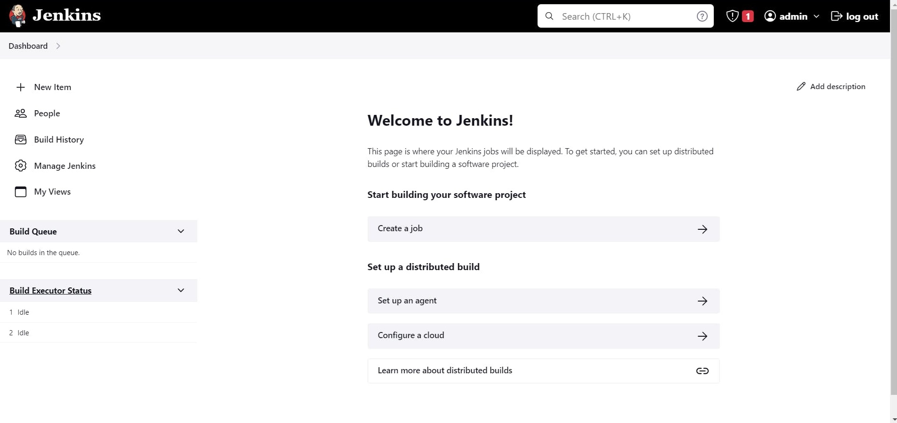
</p>

<h3><b>Step 2.2 - To Install Docker</b></h3>

```sh

# Update the package lists for upgrades and new package installations
sudo apt-get update

# Install Docker from the default repository
sudo apt-get install docker.io -y

# Add the current user to the Docker group to allow running Docker without sudo (in this case, the user is on Ubuntu)
sudo usermod -aG docker $USER   # my case is ubuntu

# Apply group changes without needing to log out and back in
newgrp docker

# Change the permissions of the Docker socket to allow all users to access Docker (not recommended for production due to security reasons)
sudo chmod 777 /var/run/docker.sock

```


<p>After the Docker installation, we will create a SonarQube container. Remember to add port 9000 in the security group.</p>


```sh

# Run a SonarQube container in detached mode, naming it 'sonar', mapping port 9000 on the host to port 9000 in the container, and using the 'lts-community' tag of the SonarQube image
docker run -d --name sonar -p 9000:9000 sonarqube:lts-community

```

<p>Now, our SonarQube instance is up and running.</p>


<p>Enter your username and password, click on 'Login', and then change your password.</p>

```sh

# Username for the login: admin
username admin

# Password for the login: admin
password admin

```

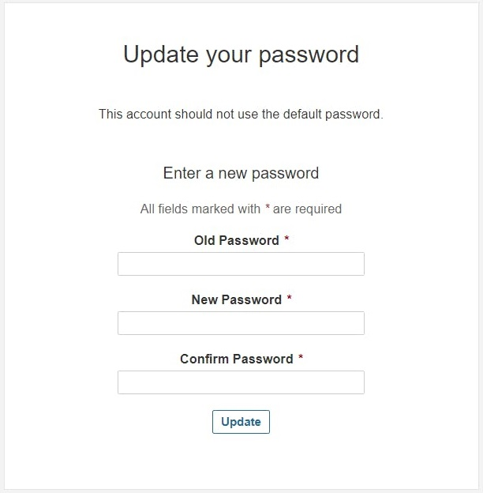

<p>Update New password, This is Sonar Dashboard.</p>

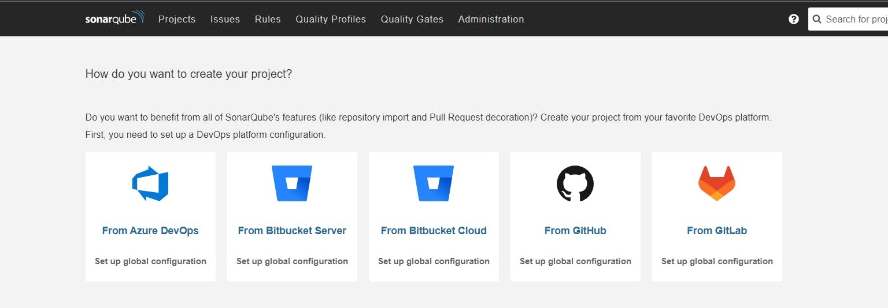

<h3><b>Step 2.2 - To Install Trivy</b></h3>

```sh

# Open or create the file 'trivy.sh' in the vi text editor
vi trivy.sh

```


```sh

# Install necessary packages: wget for downloading files, apt-transport-https for secure repository access, gnupg for encryption, and lsb-release to provide Linux Standard Base information
sudo apt-get install wget apt-transport-https gnupg lsb-release -y

# Download the GPG key for the Trivy repository and add it to the system's trusted keys
wget -qO - https://aquasecurity.github.io/trivy-repo/deb/public.key | gpg --dearmor | sudo tee /usr/share/keyrings/trivy.gpg > /dev/null

# Add the Trivy repository to the system's list of sources for packages, using the distribution's codename obtained from lsb_release
echo "deb [signed-by=/usr/share/keyrings/trivy.gpg] https://aquasecurity.github.io/trivy-repo/deb $(lsb_release -sc) main" | sudo tee -a /etc/apt/sources.list.d/trivy.list

# Update the package list to include the newly added Trivy repository
sudo apt-get update

# Install Trivy, a vulnerability scanner for containers and other artifacts
sudo apt-get install trivy -y

```


<h2><b>Step 3 - Create a TMDB API key.</b></h2>

<p><b>Next, we will create a TMDB API key. Open a new tab in your browser and search for 'TMDB.'</b></p>


<p><b>Click on the first result, and you will see this page.</b></p>


<p><b>Click on 'Login' at the top right corner. You will then see this page. If you need to create an account,</b></p>

<p><b>click on 'Click here.' Since I already have an account, I entered my details there.</b></p>

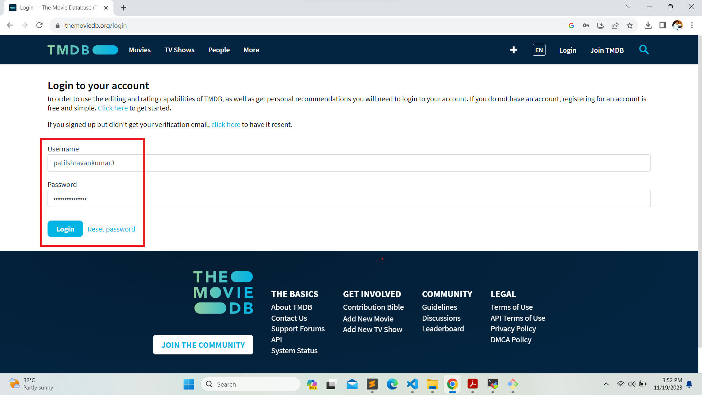

<p><b>Once you create an account, you will see this page.</b></p>

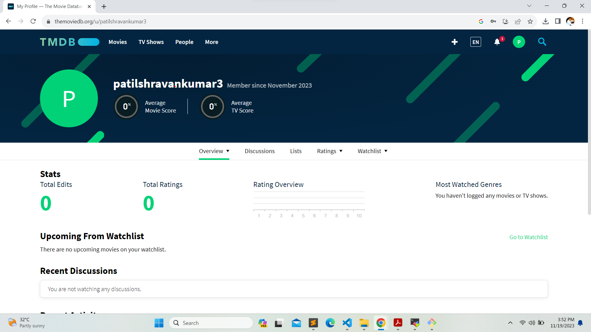

<p><b>Let's create an API key by clicking on your profile and then on 'Settings'.</b></p>

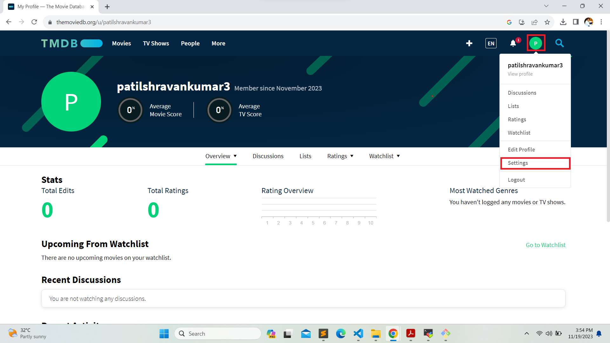

<p><b>Now, click on 'API' in the left side panel.</b></p>

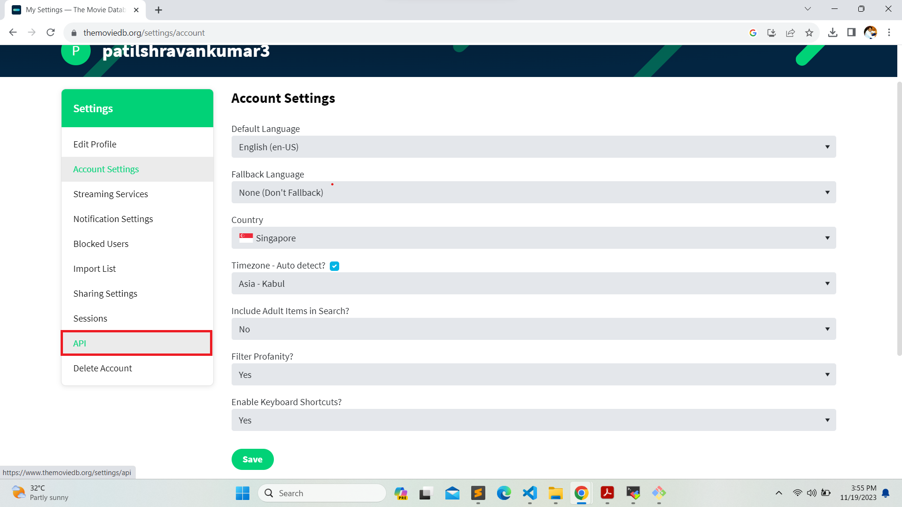

<p><b>Now click on create.</b></p>

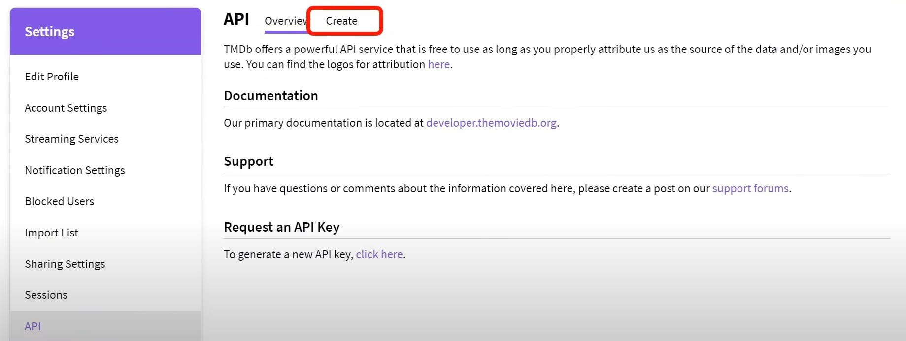

<p><b>Click on Developer.</b></p>

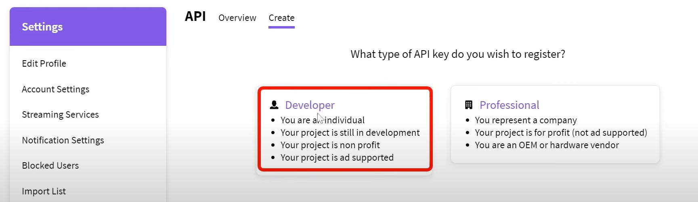

<p><b>Now you have to accept the terms and conditions.</b></p>

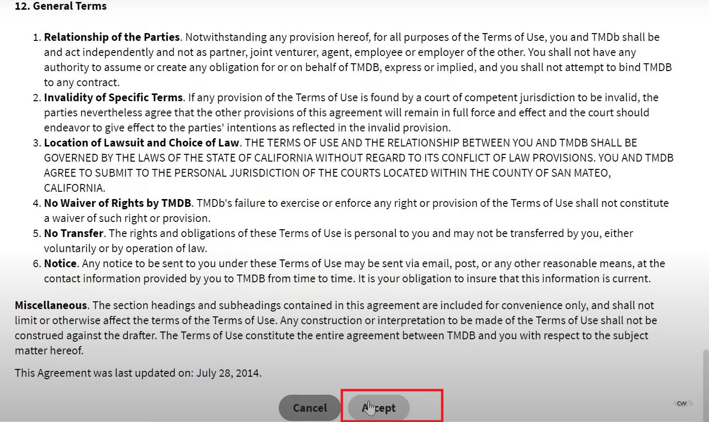

<p><b>Provide basic details</b></p>

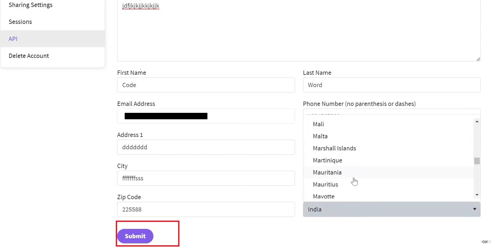

<p><b>Click on submit and you will get your API key.</b></p>

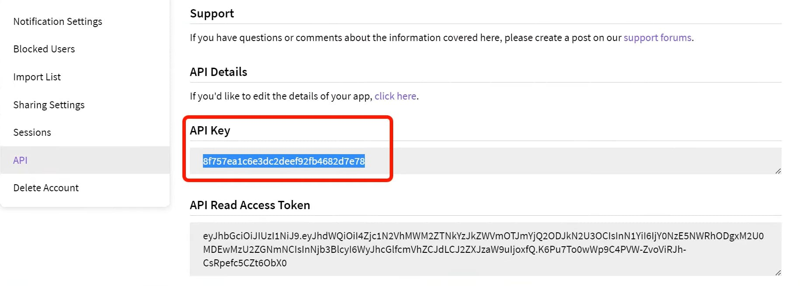

<h2><b>Step 4 - Install Prometheus and Grafana on the new server.</b></h2>
<p><b>First of all, let's create a dedicated Linux user, sometimes called a system account, for Prometheus. Having individual users for each service serves two main purposes.</b></p>
<p><b>First, it acts as a security measure to reduce the impact in case of an incident involving the service.</b></p>
<p><b>Second, it simplifies administration by making it easier to determine which resources belong to which service.</b></p>
<p><b>To create a system user or system account, run the following command:</b></p>

```sh

# Add a new user named 'prometheus' using the 'useradd' command
sudo useradd \
    # The '--system' flag creates a system account for background services
    --system \
    # The '--no-create-home' flag specifies not to create a home directory for the user
    --no-create-home \
    # The '--shell /bin/false' option sets a shell that prevents interactive login
    --shell /bin/false prometheus

```

<p><b></b>You can use the curl or wget command to download Prometheus.</p></p>

```sh

# Download the Prometheus v2.47.1 release for Linux (AMD64 architecture) using the wget command
wget https://github.com/prometheus/prometheus/releases/download/v2.47.1/prometheus-2.47.1.linux-amd64.tar.gz

```

<p><b>Then, we need to extract all Prometheus files from the archive</b></p>

```sh

# Extract the Prometheus archive using the tar command, with options to list the files being extracted (verbose) and to extract from a gzip file
tar -xvf prometheus-2.47.1.linux-amd64.tar.gz

```


<p><b>Usually, you would have a disk mounted to the data directory. For this tutorial, however, I will simply create a /data directory. <br/>Additionally, a folder is needed for the Prometheus configuration files.</b></p>


```sh

# Create the directories '/data' for storing Prometheus data and '/etc/prometheus' for its configuration files, using the 'mkdir' command with '-p' to make parent directories as needed
sudo mkdir -p /data /etc/prometheus

```

<p><b>Now, let's change to the Prometheus directory and move some files.</b></p>

```sh

# Change the current working directory to 'prometheus-2.47.1.linux-amd64', which is the directory created after extracting the Prometheus archive
cd prometheus-2.47.1.linux-amd64/

```

<p><b>First of all, let's move the Prometheus binary and promtool to /usr/local/bin. Promtool is used to check configuration files and Prometheus rules.</b></p>


```sh

# Move the 'prometheus' binary and 'promtool' to '/usr/local/bin/' to make them accessible system-wide
sudo mv prometheus promtool /usr/local/bin/

```

<p><b>Optionally, we can move the console libraries to the Prometheus configuration directory. <br/>Console templates, which utilize the Go templating language, allow for the creation of arbitrary consoles. <br/>If you're just getting started, you don't need to worry about this step.</b></p>


```sh

# Move the 'consoles' and 'console_libraries' directories to '/etc/prometheus/' to make them available for Prometheus configuration
sudo mv consoles/ console_libraries/ /etc/prometheus/

```


<p><b>Finally, let's move the example Prometheus configuration file to the main configuration location.</b></p>

```sh

# Move the Prometheus configuration file 'prometheus.yml' to the '/etc/prometheus/' directory, renaming it as necessary
sudo mv prometheus.yml /etc/prometheus/prometheus.yml

```

<p><b>To avoid permission issues, you need to set the correct ownership for the /etc/prometheus/ directory and the data directory.</b></p>


```sh

# Change the ownership of the '/etc/prometheus/' and '/data/' directories to the 'prometheus' user and group, recursively
sudo chown -R prometheus:prometheus /etc/prometheus/ /data/

```

<p><b>You can delete the archive and the Prometheus folder once you are finished.</b></p>

```sh

# Change the current working directory to the user's home directory
cd

# Remove the Prometheus archive file 'prometheus-2.47.1.linux-amd64.tar.gz' forcefully and recursively
rm -rf prometheus-2.47.1.linux-amd64.tar.gz

```

<p><b>Verify that you can execute the Prometheus binary by running the following command:</b></p>

```sh

# Check the version of Prometheus installed by running the Prometheus binary with the '--version' flag
prometheus --version

```

<p><b>To get more information and configuration options, run Prometheus Help.</b></p>

```sh

# Display the help information for the Prometheus command, including available options and flags
prometheus --help

```

<p><b>We're going to use some of these options in the service definition. <br/>We'll be using Systemd, a system and service manager for Linux operating systems, and <br/>for this purpose, we need to create a Systemd unit configuration file.</b></p>


```sh

# Open or create a new Systemd service file for Prometheus using the vim editor, located at '/etc/systemd/system/prometheus.service'
sudo vim /etc/systemd/system/prometheus.service

```

<h3><b>Prometheus.service</b></h3>

```sh

[Unit]
# Description of the service
Description=Prometheus
# Specifies that the service wants the network to be online before starting
Wants=network-online.target
# Specifies that the service should start after the network is online
After=network-online.target

# Configures the rate limiting for service restart attempts
StartLimitIntervalSec=500
StartLimitBurst=5

[Service]
# User and group under which the service will run
User=prometheus
Group=prometheus
# Type of service, 'simple' means systemd considers the service up as soon as the ExecStart process runs
Type=simple
# Service restart policy on failure
Restart=on-failure
# Time to wait before restarting the service
RestartSec=5s
# Command to start Prometheus, along with its flags
ExecStart=/usr/local/bin/prometheus \
  --config.file=/etc/prometheus/prometheus.yml \  # Path to the configuration file
  --storage.tsdb.path=/data \                      # Path for storing time series data
  --web.console.templates=/etc/prometheus/consoles \ # Path to the console templates
  --web.console.libraries=/etc/prometheus/console_libraries \ # Path to the console libraries
  --web.listen-address=0.0.0.0:9090 \               # Network address on which to expose the web interface and API
  --web.enable-lifecycle                           # Enable lifecycle APIs for remote service management

[Install]
# Defines the target that the service should be installed into
WantedBy=multi-user.target


```


<p><b>Let's review a few of the most important options related to Systemd and Prometheus. 'Restart' configures whether the service shall be restarted when the service process exits, is killed, or when a timeout is reached.</b></p>
<p><b>'RestartSec' specifies the time to wait before restarting a service. 'User' and 'Group' are the Linux user and group used to start the Prometheus process.</b></p>
<p><b> '--config.file=/etc/prometheus/prometheus.yml' specifies the path to the main Prometheus configuration file.</b></p>
<p><b>'--storage.tsdb.path=/data' indicates the location where Prometheus data is stored.</b></p>
<p><b>'--web.listen-address=0.0.0.0:9090' configures the service to listen on all network interfaces.</b></p>
<p><b>In some situations, you might use a proxy, such as Nginx, to redirect requests to Prometheus. In such cases, you would configure Prometheus to listen only on localhost.</b></p>
<p><b>'--web.enable-lifecycle' allows you to manage Prometheus, for example, to reload its configuration without restarting the service.</b></p>
<p><b>To automatically start Prometheus after a reboot, use the 'enable' command.</b></p>

</div>
