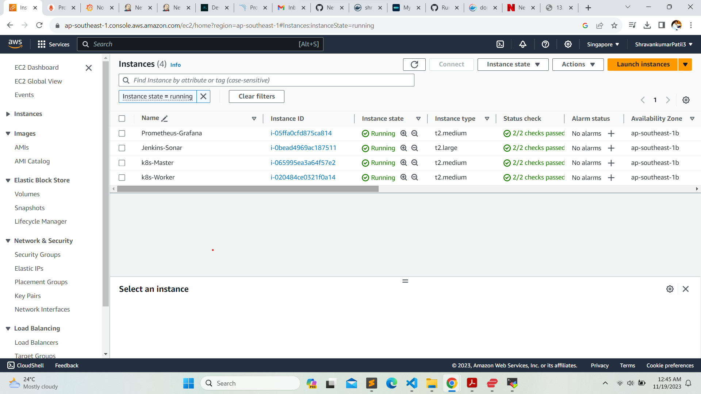
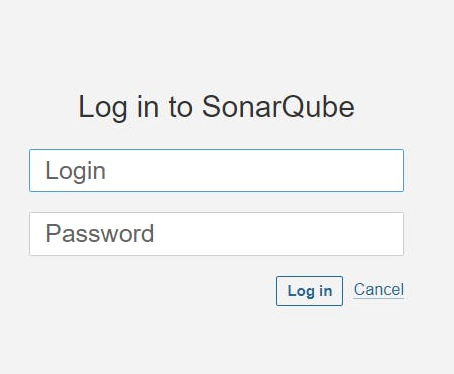
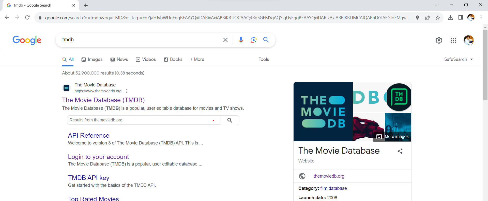

<div>
  <h1 align="center"><b>DevSecOps : Netflix Clone CI-CD with Monitoring | Email</b></h1>
  <a href="http://netflix-clone-with-tmdb-using-react-mui.vercel.app/">
    
  </a>
  <br /><br />
  <p>
    <b>Hello friends, we will be deploying a Netflix clone. We will use Jenkins as a CI/CD tool and deploy our application in a Docker container and on a Kubernetes cluster. Additionally, we will monitor the Jenkins and Kubernetes metrics using Grafana, Prometheus, and Node Exporter. I hope you find this detailed blog useful.</b>
  </p>
  <h4>
      <b>
        <u>
          <a href="https://github.com/Shravankumar1989/Netflix-clone">
            Click here for the GitHub repository.
          </a>
        </u>
      </b>
  </h4>
  <h4>
    Please follow the steps below.
  </h4>
  <p><b>Step 1 - </b>Launch an Ubuntu (22.04) T2 Large instance.</p>
  <p><b>Step 2 - </b>Install Jenkins, Docker, and Trivy. Create a SonarQube container using Docker.</p>
  <p><b>Step 3 - </b>Create a TMDB API key.</p>
  <p><b>Step 4 - </b>Install Prometheus and Grafana on the new server.</p>
  <p><b>Step 5 - </b>Install the Prometheus plugin and integrate it with the Prometheus server.</p>
  <p><b>Step 6 - </b>Set up email integration with Jenkins and plugin setup.</p>
  <p><b>Step 7 - </b>Install plugins like JDK, SonarQube Scanner, Node.js, and OWASP Dependency Check.</p>
  <p><b>Step 8 - </b>Create a pipeline project in Jenkins using a declarative pipeline.</p>
  <p><b>Step 9 - </b>Install OWASP Dependency Check plugins.</p>
  <p><b>Step 10 - </b>Build and push Docker images.</p>
  <p><b>Step 11 - </b>Deploy the image using Docker.</p>
  <p><b>Step 12 - </b>Set up Kubernetes master and worker on Ubuntu (20.04).</p>
  <p><b>Step 13 - </b>Access the Netflix app in the browser.</p>
  <p><b>Step 14 - </b>Terminate the AWS EC2 instances.</p>
  <h4>
   Now, let's get started and dig deeper into each of these steps:
  </h4>
  <h2><b>Step 1 - Launch an Ubuntu (22.04) T2 Large instance.</b></h2>
  
  <p><b>Launch an AWS T2 Large instance, using Ubuntu as the image. You can either create a new key pair or use an existing one. In the Security Group, enable HTTP and HTTPS settings, and open all ports (although it's not the best practice to open all ports, it's acceptable for learning purposes).</b></p>
  <p>
    
    <br /><br />
    
  </p>
  <h2><b>Step 2 - Install Jenkins, Docker, and Trivy. Create a SonarQube container using Docker.</b></h2>
  <h3><b>Step 2.1 - To Install Jenkins</b></h3>
  <p>Connect to your console and enter these commands to install Jenkins.</p>
  

```sh
#Make sure to run as root, or add [the command] to the user data during the EC2 instance launch.

#Create a shell script named jenkins.sh.
vi jenkins.sh

#Add the code below into the jenkins.sh file.

#!/bin/bash
# Update the package list
sudo apt update -y

# The following line is commented out. If uncommented, it would upgrade all packages.
#sudo apt upgrade -y

# Download and add the Adoptium GPG key for package verification
wget -O - https://packages.adoptium.net/artifactory/api/gpg/key/public | sudo tee /etc/apt/keyrings/adoptium.asc

# Add the Adoptium repository to the sources list
echo "deb [signed-by=/etc/apt/keyrings/adoptium.asc] https://packages.adoptium.net/artifactory/deb $(awk -F= '/^VERSION_CODENAME/{print$2}' /etc/os-release) main" | sudo tee /etc/apt/sources.list.d/adoptium.list

# Update the package list again after adding new repository
sudo apt update -y

# Install the Temurin 17 JDK package
sudo apt install temurin-17-jdk -y

# Check the Java version to confirm installation
/usr/bin/java --version

# Download and add the Jenkins GPG key for package verification
curl -fsSL https://pkg.jenkins.io/debian-stable/jenkins.io-2023.key | sudo tee /usr/share/keyrings/jenkins-keyring.asc > /dev/null

# Add the Jenkins repository to the sources list
echo deb [signed-by=/usr/share/keyrings/jenkins-keyring.asc] https://pkg.jenkins.io/debian-stable binary/ | sudo tee /etc/apt/sources.list.d/jenkins.list > /dev/null

# Update the package list again after adding the Jenkins repository
sudo apt-get update -y

# Install Jenkins
sudo apt-get install jenkins -y

# Start the Jenkins service
sudo systemctl start jenkins

# Check the status of the Jenkins service
sudo systemctl status jenkins
```

```sh
# Grant all users read, write, and execute permissions on the jenkins.sh file
sudo chmod 777 jenkins.sh

# Execute the jenkins.sh script
./jenkins.sh
```


<p>Once Jenkins is installed, you will need to go to your AWS EC2 Security Group and open inbound port 8080, as Jenkins operates on this port. <br/>Then, obtain your public IP address.</p>


```sh
<EC2 Instance Public IP Address:8080>
#Example
https://13.229.211.33:8080

# Display the initial admin password for Jenkins, stored in the specified file
sudo cat /var/lib/jenkins/secrets/initialAdminPassword
```


<p>
    
    <p>Unlock Jenkins using an administrative password and install the suggested plugins.</p>
    
    <p>Jenkins will now be installed, along with all the necessary libraries.</p>
    
    <p>Create a user, then click on 'Save and Continue.'</p>
    <p>This is the Jenkins Getting Started Screen.</p>
    
</p>

<h3><b>Step 2.2 - To Install Docker</b></h3>

```sh

# Update the package lists for upgrades and new package installations
sudo apt-get update

# Install Docker from the default repository
sudo apt-get install docker.io -y

# Add the current user to the Docker group to allow running Docker without sudo (in this case, the user is on Ubuntu)
sudo usermod -aG docker $USER   # my case is ubuntu

# Apply group changes without needing to log out and back in
newgrp docker

# Change the permissions of the Docker socket to allow all users to access Docker (not recommended for production due to security reasons)
sudo chmod 777 /var/run/docker.sock

```


<p>After the Docker installation, we will create a SonarQube container. Remember to add port 9000 in the security group.</p>


```sh

# Run a SonarQube container in detached mode, naming it 'sonar', mapping port 9000 on the host to port 9000 in the container, and using the 'lts-community' tag of the SonarQube image
docker run -d --name sonar -p 9000:9000 sonarqube:lts-community

```

<p>Now, our SonarQube instance is up and running.</p>



<p>Enter your username and password, click on 'Login', and then change your password.</p>

```sh

# Username for the login: admin
username admin

# Password for the login: admin
password admin

```


<p>Update New password, This is Sonar Dashboard.</p>


<h3><b>Step 2.2 - To Install Trivy</b></h3>

```sh

# Open or create the file 'trivy.sh' in the vi text editor
vi trivy.sh

```


```sh

# Install necessary packages: wget for downloading files, apt-transport-https for secure repository access, gnupg for encryption, and lsb-release to provide Linux Standard Base information
sudo apt-get install wget apt-transport-https gnupg lsb-release -y

# Download the GPG key for the Trivy repository and add it to the system's trusted keys
wget -qO - https://aquasecurity.github.io/trivy-repo/deb/public.key | gpg --dearmor | sudo tee /usr/share/keyrings/trivy.gpg > /dev/null

# Add the Trivy repository to the system's list of sources for packages, using the distribution's codename obtained from lsb_release
echo "deb [signed-by=/usr/share/keyrings/trivy.gpg] https://aquasecurity.github.io/trivy-repo/deb $(lsb_release -sc) main" | sudo tee -a /etc/apt/sources.list.d/trivy.list

# Update the package list to include the newly added Trivy repository
sudo apt-get update

# Install Trivy, a vulnerability scanner for containers and other artifacts
sudo apt-get install trivy -y

```


<h2><b>Step 3 - Create a TMDB API key.</b></h2>

<p><b>Next, we will create a TMDB API key. Open a new tab in your browser and search for 'TMDB.'</b></p>



<p><b>Click on the first result, and you will see this page.</b></p>


<p><b>Click on 'Login' at the top right corner. You will then see this page. If you need to create an account,</b></p>

<p><b>click on 'Click here.' Since I already have an account, I entered my details there.</b></p>


<p><b>Once you create an account, you will see this page.</b></p>


<p><b>Let's create an API key by clicking on your profile and then on 'Settings'.</b></p>


<p><b>Now, click on 'API' in the left side panel.</b></p>


<p><b>Now click on create.</b></p>


<p><b>Click on Developer.</b></p>


<p><b>Now you have to accept the terms and conditions.</b></p>


<p><b>Provide basic details</b></p>


<p><b>Click on submit and you will get your API key.</b></p>


</div>
