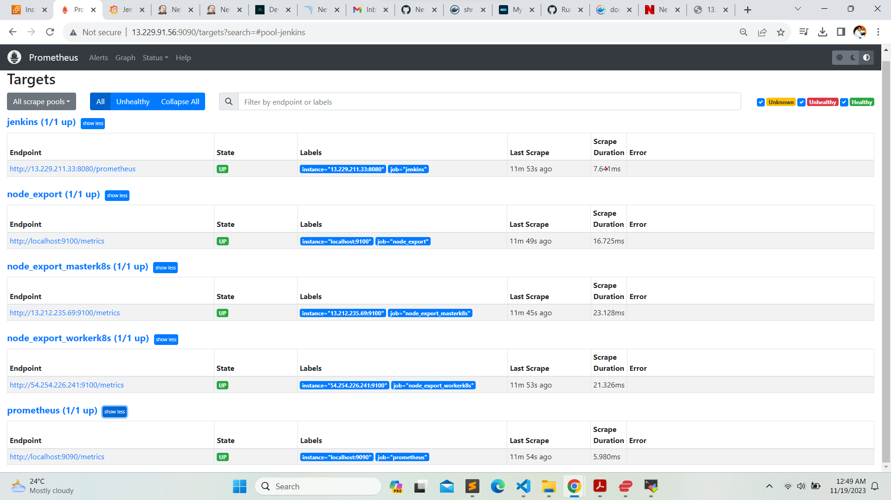
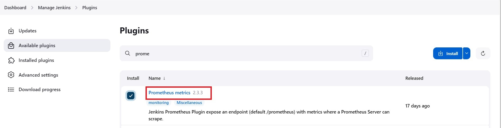
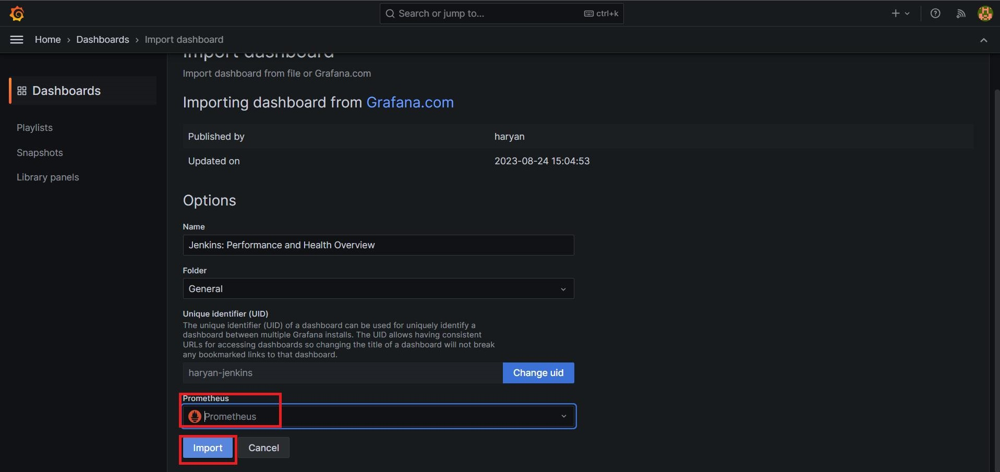
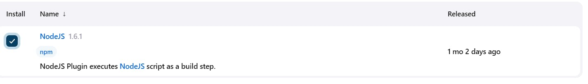

<div>
  <h1 align="center"><b>DevSecOps : Netflix Clone CI-CD with Monitoring | Email</b></h1>
  <a href="http://netflix-clone-with-tmdb-using-react-mui.vercel.app/">
    
  </a>
  <br /><br />
  <p>
    <b>Hello friends, we will be deploying a Netflix clone. We will use Jenkins as a CI/CD tool and deploy our application in a Docker container and on a Kubernetes cluster. Additionally, we will monitor the Jenkins and Kubernetes metrics using Grafana, Prometheus, and Node Exporter. I hope you find this detailed blog useful.</b>
  </p>
  <h4>
      <b>
        <u>
          <a href="https://github.com/Shravankumar1989/Netflix-clone">
            Click here for the GitHub repository.
          </a>
        </u>
      </b>
  </h4>
  <h4>
    Please follow the steps below.
  </h4>
  <p><b>Step 1 - </b>Launch an Ubuntu (22.04) T2 Large instance.</p>
  <p><b>Step 2 - </b>Install Jenkins, Docker, and Trivy. Create a SonarQube container using Docker.</p>
  <p><b>Step 3 - </b>Create a TMDB API key.</p>
  <p><b>Step 4 - </b>Install Prometheus and Grafana on the new server.</p>
  <p><b>Step 5 - </b>Install the Prometheus plugin and integrate it with the Prometheus server.</p>
  <p><b>Step 6 - </b>Set up email integration with Jenkins and plugin setup.</p>
  <p><b>Step 7 - </b>Install plugins like JDK, SonarQube Scanner, Node.js, and OWASP Dependency Check.</p>
  <p><b>Step 8 - </b>Create a pipeline project in Jenkins using a declarative pipeline.</p>
  <p><b>Step 9 - </b>Install OWASP Dependency Check plugins.</p>
  <p><b>Step 10 - </b>Build and push Docker images.</p>
  <p><b>Step 11 - </b>Deploy the image using Docker.</p>
  <p><b>Step 12 - </b>Set up Kubernetes master and worker on Ubuntu (20.04).</p>
  <p><b>Step 13 - </b>Access the Netflix app in the browser.</p>
  <p><b>Step 14 - </b>Terminate the AWS EC2 instances.</p>
  <h4>
   Now, let's get started and dig deeper into each of these steps:
  </h4>
  <h2><b>Step 1 - Launch an Ubuntu (22.04) T2 Large instance.</b></h2>
  
  <p><b>Launch an AWS T2 Large instance, using Ubuntu as the image. You can either create a new key pair or use an existing one. In the Security Group, enable HTTP and HTTPS settings, and open all ports (although it's not the best practice to open all ports, it's acceptable for learning purposes).</b></p>
  <p>
    
    <br /><br />
    
  </p>
  <h2><b>Step 2 - Install Jenkins, Docker, and Trivy. Create a SonarQube container using Docker.</b></h2>
  <h3><b>Step 2.1 - To Install Jenkins</b></h3>
  <p>Connect to your console and enter these commands to install Jenkins.</p>
  

```sh
#Make sure to run as root, or add [the command] to the user data during the EC2 instance launch.

#Create a shell script named jenkins.sh.
vi jenkins.sh

#Add the code below into the jenkins.sh file.

#!/bin/bash
# Update the package list
sudo apt update -y

# The following line is commented out. If uncommented, it would upgrade all packages.
#sudo apt upgrade -y

# Download and add the Adoptium GPG key for package verification
wget -O - https://packages.adoptium.net/artifactory/api/gpg/key/public | sudo tee /etc/apt/keyrings/adoptium.asc

# Add the Adoptium repository to the sources list
echo "deb [signed-by=/etc/apt/keyrings/adoptium.asc] https://packages.adoptium.net/artifactory/deb $(awk -F= '/^VERSION_CODENAME/{print$2}' /etc/os-release) main" | sudo tee /etc/apt/sources.list.d/adoptium.list

# Update the package list again after adding new repository
sudo apt update -y

# Install the Temurin 17 JDK package
sudo apt install temurin-17-jdk -y

# Check the Java version to confirm installation
/usr/bin/java --version

# Download and add the Jenkins GPG key for package verification
curl -fsSL https://pkg.jenkins.io/debian-stable/jenkins.io-2023.key | sudo tee /usr/share/keyrings/jenkins-keyring.asc > /dev/null

# Add the Jenkins repository to the sources list
echo deb [signed-by=/usr/share/keyrings/jenkins-keyring.asc] https://pkg.jenkins.io/debian-stable binary/ | sudo tee /etc/apt/sources.list.d/jenkins.list > /dev/null

# Update the package list again after adding the Jenkins repository
sudo apt-get update -y

# Install Jenkins
sudo apt-get install jenkins -y

# Start the Jenkins service
sudo systemctl start jenkins

# Check the status of the Jenkins service
sudo systemctl status jenkins
```

```sh
# Grant all users read, write, and execute permissions on the jenkins.sh file
sudo chmod 777 jenkins.sh

# Execute the jenkins.sh script
./jenkins.sh
```


<p>Once Jenkins is installed, you will need to go to your AWS EC2 Security Group and open inbound port 8080, as Jenkins operates on this port. <br/>Then, obtain your public IP address.</p>


```sh
<EC2 Instance Public IP Address:8080>
#Example
https://13.229.211.33:8080

# Display the initial admin password for Jenkins, stored in the specified file
sudo cat /var/lib/jenkins/secrets/initialAdminPassword
```


<p>
    
    <p>Unlock Jenkins using an administrative password and install the suggested plugins.</p>
    
    <p>Jenkins will now be installed, along with all the necessary libraries.</p>
    
    <p>Create a user, then click on 'Save and Continue.'</p>
    <p>This is the Jenkins Getting Started Screen.</p>
    
</p>

<h3><b>Step 2.2 - To Install Docker</b></h3>

```sh

# Update the package lists for upgrades and new package installations
sudo apt-get update

# Install Docker from the default repository
sudo apt-get install docker.io -y

# Add the current user to the Docker group to allow running Docker without sudo (in this case, the user is on Ubuntu)
sudo usermod -aG docker $USER   # my case is ubuntu

# Apply group changes without needing to log out and back in
newgrp docker

# Change the permissions of the Docker socket to allow all users to access Docker (not recommended for production due to security reasons)
sudo chmod 777 /var/run/docker.sock

```


<p>After the Docker installation, we will create a SonarQube container. Remember to add port 9000 in the security group.</p>


```sh

# Run a SonarQube container in detached mode, naming it 'sonar', mapping port 9000 on the host to port 9000 in the container, and using the 'lts-community' tag of the SonarQube image
docker run -d --name sonar -p 9000:9000 sonarqube:lts-community

```

<p>Now, our SonarQube instance is up and running.</p>


<p>Enter your username and password, click on 'Login', and then change your password.</p>

```sh

# Username for the login: admin
username admin

# Password for the login: admin
password admin

```


<p>Update New password, This is Sonar Dashboard.</p>


<h3><b>Step 2.2 - To Install Trivy</b></h3>

```sh

# Open or create the file 'trivy.sh' in the vi text editor
vi trivy.sh

```


```sh

# Install necessary packages: wget for downloading files, apt-transport-https for secure repository access, gnupg for encryption, and lsb-release to provide Linux Standard Base information
sudo apt-get install wget apt-transport-https gnupg lsb-release -y

# Download the GPG key for the Trivy repository and add it to the system's trusted keys
wget -qO - https://aquasecurity.github.io/trivy-repo/deb/public.key | gpg --dearmor | sudo tee /usr/share/keyrings/trivy.gpg > /dev/null

# Add the Trivy repository to the system's list of sources for packages, using the distribution's codename obtained from lsb_release
echo "deb [signed-by=/usr/share/keyrings/trivy.gpg] https://aquasecurity.github.io/trivy-repo/deb $(lsb_release -sc) main" | sudo tee -a /etc/apt/sources.list.d/trivy.list

# Update the package list to include the newly added Trivy repository
sudo apt-get update

# Install Trivy, a vulnerability scanner for containers and other artifacts
sudo apt-get install trivy -y

```


<h2><b>Step 3 - Create a TMDB API key.</b></h2>

<p><b>Next, we will create a TMDB API key. Open a new tab in your browser and search for 'TMDB.'</b></p>


<p><b>Click on the first result, and you will see this page.</b></p>


<p><b>Click on 'Login' at the top right corner. You will then see this page. If you need to create an account,</b></p>

<p><b>click on 'Click here.' Since I already have an account, I entered my details there.</b></p>


<p><b>Once you create an account, you will see this page.</b></p>


<p><b>Let's create an API key by clicking on your profile and then on 'Settings'.</b></p>


<p><b>Now, click on 'API' in the left side panel.</b></p>


<p><b>Now click on create.</b></p>


<p><b>Click on Developer.</b></p>


<p><b>Now you have to accept the terms and conditions.</b></p>


<p><b>Provide basic details</b></p>


<p><b>Click on submit and you will get your API key.</b></p>


<h2><b>Step 4 - Install Prometheus and Grafana on the new server.</b></h2>
<p><b>First of all, let's create a dedicated Linux user, sometimes called a system account, for Prometheus. Having individual users for each service serves two main purposes.</b></p>
<p><b>First, it acts as a security measure to reduce the impact in case of an incident involving the service.</b></p>
<p><b>Second, it simplifies administration by making it easier to determine which resources belong to which service.</b></p>
<p><b>To create a system user or system account, run the following command:</b></p>

```sh

# Add a new user named 'prometheus' using the 'useradd' command
sudo useradd \
    # The '--system' flag creates a system account for background services
    --system \
    # The '--no-create-home' flag specifies not to create a home directory for the user
    --no-create-home \
    # The '--shell /bin/false' option sets a shell that prevents interactive login
    --shell /bin/false prometheus

```

<p><b></b>You can use the curl or wget command to download Prometheus.</p></p>

```sh

# Download the Prometheus v2.47.1 release for Linux (AMD64 architecture) using the wget command
wget https://github.com/prometheus/prometheus/releases/download/v2.47.1/prometheus-2.47.1.linux-amd64.tar.gz

```

<p><b>Then, we need to extract all Prometheus files from the archive</b></p>

```sh

# Extract the Prometheus archive using the tar command, with options to list the files being extracted (verbose) and to extract from a gzip file
tar -xvf prometheus-2.47.1.linux-amd64.tar.gz

```


<p><b>Usually, you would have a disk mounted to the data directory. For this tutorial, however, I will simply create a /data directory. <br/>Additionally, a folder is needed for the Prometheus configuration files.</b></p>


```sh

# Create the directories '/data' for storing Prometheus data and '/etc/prometheus' for its configuration files, using the 'mkdir' command with '-p' to make parent directories as needed
sudo mkdir -p /data /etc/prometheus

```

<p><b>Now, let's change to the Prometheus directory and move some files.</b></p>

```sh

# Change the current working directory to 'prometheus-2.47.1.linux-amd64', which is the directory created after extracting the Prometheus archive
cd prometheus-2.47.1.linux-amd64/

```

<p><b>First of all, let's move the Prometheus binary and promtool to /usr/local/bin. Promtool is used to check configuration files and Prometheus rules.</b></p>


```sh

# Move the 'prometheus' binary and 'promtool' to '/usr/local/bin/' to make them accessible system-wide
sudo mv prometheus promtool /usr/local/bin/

```

<p><b>Optionally, we can move the console libraries to the Prometheus configuration directory. <br/>Console templates, which utilize the Go templating language, allow for the creation of arbitrary consoles. <br/>If you're just getting started, you don't need to worry about this step.</b></p>


```sh

# Move the 'consoles' and 'console_libraries' directories to '/etc/prometheus/' to make them available for Prometheus configuration
sudo mv consoles/ console_libraries/ /etc/prometheus/

```


<p><b>Finally, let's move the example Prometheus configuration file to the main configuration location.</b></p>

```sh

# Move the Prometheus configuration file 'prometheus.yml' to the '/etc/prometheus/' directory, renaming it as necessary
sudo mv prometheus.yml /etc/prometheus/prometheus.yml

```

<p><b>To avoid permission issues, you need to set the correct ownership for the /etc/prometheus/ directory and the data directory.</b></p>


```sh

# Change the ownership of the '/etc/prometheus/' and '/data/' directories to the 'prometheus' user and group, recursively
sudo chown -R prometheus:prometheus /etc/prometheus/ /data/

```

<p><b>You can delete the archive and the Prometheus folder once you are finished.</b></p>

```sh

# Change the current working directory to the user's home directory
cd

# Remove the Prometheus archive file 'prometheus-2.47.1.linux-amd64.tar.gz' forcefully and recursively
rm -rf prometheus-2.47.1.linux-amd64.tar.gz

```

<p><b>Verify that you can execute the Prometheus binary by running the following command:</b></p>

```sh

# Check the version of Prometheus installed by running the Prometheus binary with the '--version' flag
prometheus --version

```

<p><b>To get more information and configuration options, run Prometheus Help.</b></p>

```sh

# Display the help information for the Prometheus command, including available options and flags
prometheus --help

```

<p><b>We're going to use some of these options in the service definition. <br/>We'll be using Systemd, a system and service manager for Linux operating systems, and <br/>for this purpose, we need to create a Systemd unit configuration file.</b></p>


```sh

# Open or create a new Systemd service file for Prometheus using the vim editor, located at '/etc/systemd/system/prometheus.service'
sudo vim /etc/systemd/system/prometheus.service

```

<h3><b>Prometheus.service</b></h3>

```sh

[Unit]
# Description of the service
Description=Prometheus
# Specifies that the service wants the network to be online before starting
Wants=network-online.target
# Specifies that the service should start after the network is online
After=network-online.target

# Configures the rate limiting for service restart attempts
StartLimitIntervalSec=500
StartLimitBurst=5

[Service]
# User and group under which the service will run
User=prometheus
Group=prometheus
# Type of service, 'simple' means systemd considers the service up as soon as the ExecStart process runs
Type=simple
# Service restart policy on failure
Restart=on-failure
# Time to wait before restarting the service
RestartSec=5s
# Command to start Prometheus, along with its flags
ExecStart=/usr/local/bin/prometheus \
  --config.file=/etc/prometheus/prometheus.yml \  # Path to the configuration file
  --storage.tsdb.path=/data \                      # Path for storing time series data
  --web.console.templates=/etc/prometheus/consoles \ # Path to the console templates
  --web.console.libraries=/etc/prometheus/console_libraries \ # Path to the console libraries
  --web.listen-address=0.0.0.0:9090 \               # Network address on which to expose the web interface and API
  --web.enable-lifecycle                           # Enable lifecycle APIs for remote service management

[Install]
# Defines the target that the service should be installed into
WantedBy=multi-user.target


```


<p><b>Let's review a few of the most important options related to Systemd and Prometheus. 'Restart' configures whether the service shall be restarted when the service process exits, is killed, or when a timeout is reached.</b></p>
<p><b>'RestartSec' specifies the time to wait before restarting a service. 'User' and 'Group' are the Linux user and group used to start the Prometheus process.</b></p>
<p><b> '--config.file=/etc/prometheus/prometheus.yml' specifies the path to the main Prometheus configuration file.</b></p>
<p><b>'--storage.tsdb.path=/data' indicates the location where Prometheus data is stored.</b></p>
<p><b>'--web.listen-address=0.0.0.0:9090' configures the service to listen on all network interfaces.</b></p>
<p><b>In some situations, you might use a proxy, such as Nginx, to redirect requests to Prometheus. In such cases, you would configure Prometheus to listen only on localhost.</b></p>
<p><b>'--web.enable-lifecycle' allows you to manage Prometheus, for example, to reload its configuration without restarting the service.</b></p>
<p><b>To automatically start Prometheus after a reboot, use the 'enable' command.</b></p>


```sh

# Enable the Prometheus service to start automatically at system boot using systemctl
sudo systemctl enable prometheus

```
<p><b>Then just start the Prometheus.</b></p>

```sh

# Start the Prometheus service immediately using systemctl
sudo systemctl start prometheus

```

<p><b>To check the status of Prometheus run the following command:</b></p>

```sh

# Check the current status of the Prometheus service using systemctl
sudo systemctl status prometheus

```


<p><b>Suppose you encounter any issues with Prometheus or are unable to start it. In that case, the easiest way to identify the problem is to use the journalctl command and search for errors.</b></p>

```sh

# Use journalctl to display and follow the real-time log output of the Prometheus service, without using a pager
journalctl -u prometheus -f --no-pager

```

<p><b>Now, we can try to access Prometheus via the browser using the IP address of the Ubuntu server. Remember to append port 9090 to the IP address.</b></p>

```sh

<public-ip:9090>
#Example
https://13.229.211.33:9090

```


<p><b>If you go to the 'Targets' section, you should see only one target, which is Prometheus itself. It scrapes its metrics every 15 seconds by default.</b></p>

<h2><b>Install Node Exporter on Ubuntu 22.04</b></h2>

<p><b>Next, we're going to set up and configure Node Exporter to collect Linux system metrics, such as CPU load and disk I/O. Node Exporter will expose these metrics in a Prometheus-compatible format. Since the installation process is very similar to that of Prometheus, I will not cover it in as much detail.</b></p>

<p><b>First, let's create a system user for Node Exporter by running the following command:"</b></p>


```sh

# Add a new system user named 'node_exporter' using the 'useradd' command
sudo useradd \
    # The '--system' flag creates a system account for background services
    --system \
    # The '--no-create-home' flag specifies not to create a home directory for the user
    --no-create-home \
    # The '--shell /bin/false' option sets a shell that prevents interactive login
    --shell /bin/false node_exporter

```
<p><b>Use the wget command to download the binary.</b></p>

```sh

# Download the Node Exporter v1.6.1 release for Linux (AMD64 architecture) using the wget command
wget https://github.com/prometheus/node_exporter/releases/download/v1.6.1/node_exporter-1.6.1.linux-amd64.tar.gz

```

<p><b>Extract the Node Exporter from the archive.</b></p>

```sh

# Extract the Node Exporter archive using the tar command, with options to list the files being extracted (verbose) and to extract from a gzip file
tar -xvf node_exporter-1.6.1.linux-amd64.tar.gz

```

<p><b>Move the binary to /usr/local/bin.</b></p>

```sh

# Move the Node Exporter binary from the extracted directory to '/usr/local/bin/' for system-wide access
sudo mv \
  node_exporter-1.6.1.linux-amd64/node_exporter \
  /usr/local/bin/

```


<p><b>Clean up by deleting the Node Exporter archive and folder.</b></p>

```sh

# Remove the Node Exporter directory and any files beginning with 'node_exporter', forcefully and recursively
rm -rf node_exporter*

```

<p><b>Verify that you can run the binary.</b></p>

```sh

# Check the version of Node Exporter installed by running the Node Exporter binary with the '--version' flag
node_exporter --version

```

<p><b>Node Exporter offers many plugins that can be enabled. Running Node Exporter with the help option will display all available options.</b></p>

```sh

# Display the help information for the Node Exporter command, including available options and flags
node_exporter --help

```

<p><b>We're going to enable the login controller (--collector.logind) for the demo.</b></p>

<p><b>Next, create a similar systemd unit file.</b></p>

```sh

# Open or create a new Systemd service file for Node Exporter using the vim editor, located at '/etc/systemd/system/node_exporter.service'
sudo vim /etc/systemd/system/node_exporter.service

```

<h4><b>node_exporter.service</b></h4>

```sh

[Unit]
# Description of the service
Description=Node Exporter
# Specifies that the service wants the network to be online before starting
Wants=network-online.target
# Specifies that the service should start after the network is online
After=network-online.target

# Configures the rate limiting for service restart attempts
StartLimitIntervalSec=500
StartLimitBurst=5

[Service]
# User and group under which the service will run
User=node_exporter
Group=node_exporter
# Type of service, 'simple' means systemd considers the service up as soon as the ExecStart process runs
Type=simple
# Service restart policy on failure
Restart=on-failure
# Time to wait before restarting the service
RestartSec=5s
# Command to start Node Exporter, along with its flags
ExecStart=/usr/local/bin/node_exporter \
    --collector.logind   # Enable the login session collector

[Install]
# Defines the target that the service should be installed into
WantedBy=multi-user.target


```

<p><b>Replace Prometheus user and group to node_exporter, and update the ExecStart command.</b></p>
<p><b>To automatically start the Node Exporter after reboot, enable the service.</b></p>


```sh

#Enable the Node Exporter service to start automatically at system boot.
sudo systemctl enable node_exporter

```
<p><b>Then start the Node Exporter.</b></p>

```sh

#Start the Node Exporter service immediately.
sudo systemctl start node_exporter

```
<p><b>Check the status of Node Exporter with the following command:</b></p>

```sh

#Check the current status of the Node Exporter service.
sudo systemctl status node_exporter

```
<p><b>If you have any issues, check logs with journalctl</b></p>

```sh

#Display the real-time log output of the Node Exporter service, without paging through the output.
journalctl -u node_exporter -f --no-pager

```
<p><b>To create a static target, you need to add a job_name along with static_configs in the Prometheus server configuration.</b></p>

```sh

#Open the Prometheus configuration file for editing using the vim text editor.
sudo vim /etc/prometheus/prometheus.yml

```
<p><b>prometheus.yml</b></p>

```sh

#Define a job named 'node_export' in the Prometheus configuration.
  - job_name: node_export
    #Set static configurations for the job.
    static_configs:
      #Specify localhost and port 9100 as the target for this job.
      - targets: ["localhost:9100"]

```
<p><b>By default, Node Exporter will be exposed on port 9100.</b></p>
<p><b>Since we enabled lifecycle management via API calls, we can reload the Prometheus config without restarting the service and causing downtime.</b></p>
<p><b>Before, restarting check if the config is valid.</b></p>

```sh

#Validate the Prometheus configuration file for syntax correctness.
promtool check config /etc/prometheus/prometheus.yml

```
<p><b>Then, you can use a POST request to reload the config.</b></p>

```sh

#Send a POST request to reload the Prometheus configuration without restarting the service.
curl -X POST http://localhost:9090/-/reload

```
<p><b>Check the targets section</b></p>

```sh

#URL to access the Prometheus targets page in a web browser (replace <ip> with your server's IP address).
http://<ip>:9090/targets

```



<h2><b>Install Grafana on Ubuntu 22.04</b></h2>
<p><b>To visualize metrics we can use Grafana. There are many different data sources that Grafana supports, one of them is Prometheus.</b></p>
<p><b>First, let's make sure that all the dependencies are installed.</b></p>

```sh

#Install packages to enable HTTPS for package repositories and software management.
sudo apt-get install -y apt-transport-https software-properties-common

```
<p><b>Next, add the GPG key.</b></p>

```sh

#Download and add the Grafana repository GPG key.
wget -q -O - https://packages.grafana.com/gpg.key | sudo apt-key add -

```
<p><b>Add this repository for stable releases.</b></p>

```sh

#Add the Grafana package repository.
echo "deb https://packages.grafana.com/oss/deb stable main" | sudo tee -a /etc/apt/sources.list.d/grafana.list

```
<p><b>After you add the repository, update and install Garafana.</b></p>

```sh

#Update the package lists with the new Grafana repository.
sudo apt-get update

#Install Grafana.
sudo apt-get -y install grafana

```
<p><b>To automatically start the Grafana after reboot, enable the service.</b></p>

```sh

#Enable Grafana server to start automatically at system boot.
sudo systemctl enable grafana-server

```
<p><b>Then start the Grafana.</b></p>

```sh

#Start the Grafana server service.
sudo systemctl start grafana-server

```
<p><b>To check the status of Grafana, run the following command:</b></p>

```sh

#Check the current status of the Grafana server service.
sudo systemctl status grafana-server

```
<p><b>Go to http://<ip>:3000 and log in to the Grafana using default credentials. The username is admin, and the password is admin as well.</b></p>

```sh

  #Default Grafana admin username.
  username admin
  #Default Grafana admin password.
  password admin

```


<p><b>When you log in for the first time, you get the option to change the password.</b></p>


<p><b>To visualize metrics, you need to add a data source first.</b></p>


<p><b>Click Add data source and select Prometheus.</b></p>


<p><b>For the URL, enter localhost:9090 and click Save and test. You can see Data source is working.</b></p>


```sh

#URL to access Prometheus web UI (replace <public-ip> with your server's public IP address).
<public-ip:9090>

```


<p><b>Click on Save and Test.</b></p>


<p><b>Let's add Dashboard for a better view</b></p>


<p><b>Click on Import Dashboard paste this code 1860 and click on load</b></p>


<p><b>Select the Datasource and click on Import</b></p>


<p><b>You will see this output</b></p>


<h2><b>Step 5 - Install the Prometheus Plugin and Integrate it with the Prometheus server</b></h2>

<p><b>Let's Monitor JENKINS SYSTEM</b></p>

<p><b>Need Jenkins up and running machine</b></p>

<p><b>Goto Manage Jenkins --> Plugins --> Available Plugins</b></p>

<p><b>Search for Prometheus and install it</b></p>



<p><b>Once that is done you will Prometheus is set to /Prometheus path in system configurations</b></p>


<p><b>Nothing to change click on apply and save</b></p>

<p><b>To create a static target, you need to add job_name with static_configs. go to Prometheus server</b></p>


```sh

#Open the Prometheus configuration file again for further editing.
sudo vim /etc/prometheus/prometheus.yml

```

<p><b>Paste below code</b></p>

```sh

- job_name: 'jenkins'                   # Define a new job named 'jenkins'
  metrics_path: '/prometheus'           # Set the path to scrape metrics from
  static_configs:                       # Begin static configuration block
    - targets: ['<jenkins-ip>:8080']    # Specify the Jenkins target, with its IP and port

```

<p><b>Before, restarting check if the config is valid.</b></p>

```sh

#Validate the Prometheus configuration file for syntax correctness
promtool check config /etc/prometheus/prometheus.yml

```

<p><b>Then, you can use a POST request to reload the config.</b></p>

```sh

# 23. Reload the Prometheus configuration without restarting the service
curl -X POST http://localhost:9090/-/reload


```

<p><b>Check the targets section</b></p>

```sh

#Access the Prometheus targets page in a web browser (replace <ip> with your server's IP)
http://<ip>:9090/targets


```

<p><b>You will see Jenkins is added to it</b></p>


<p><b>Let's add Dashboard for a better view in Grafana</b></p>

<p><b>Click On Dashboard --> + symbol --> Import Dashboard</b></p>

<p><b>Use Id 9964 and click on load</b></p>


<p><b>Select the data source and click on Import</b></p>



<p><b>Now you will see the Detailed overview of Jenkins</b></p>


<h2><b>Step 6 — Email Integration With Jenkins and Plugin Setup</b></h2>

<p><b>Install Email Extension Plugin in Jenkins</b></p>


<p><b>Go to your Gmail and click on your profile</b></p>

<p><b>Then click on Manage Your Google Account --> click on the security tab on the left side panel you will get this page(provide mail password).</b></p>


<p><b>2-step verification should be enabled.</b></p>

<p><b>Search for the app in the search bar you will get app passwords like the below image</b></p>


<p><b>Click on other and provide your name and click on Generate and copy the password</b></p>


<p><b>In the new update, you will get a password like this</b></p>


<p><b>Once the plugin is installed in Jenkins, click on manage Jenkins --> configure system there under the E-mail Notification section configure the details as shown in the below image</b></p>


<p><b>Click on Apply and save.</b></p>

<p><b>Click on Manage Jenkins--> credentials and add your mail username and generated password</b></p>


<p><b>This is to just verify the mail configuration</b></p>

<p><b>Now under the Extended E-mail Notification section configure the details as shown in the below images</b></p>


<p><b>Click on Apply and save.</b></p>

<p><b>Next, we will log in to Jenkins and start to configure our Pipeline in Jenkins</b></p>

<h2><b>Step 7 - Install Plugins like JDK, Sonarqube Scanner, NodeJs, OWASP Dependency Check</b></h2>

<h2><b>7.1 - Install Plugin</b></h2>

<p><b>Goto Manage Jenkins →Plugins → Available Plugins →</b></p>

<p><b>Install below plugins</b></p>

<p><b>1 → Eclipse Temurin Installer (Install without restart)</b></p>

<p><b>2 → SonarQube Scanner (Install without restart)</b></p>

<p><b>3 → NodeJs Plugin (Install Without restart)</b></p>




<h3><b>7.2 - Configure Java and Nodejs in Global Tool Configuration</b></h3>

<p><b>Goto Manage Jenkins → Tools → Install JDK(17) and NodeJs(16)→ Click on Apply and Save</b></p>


<h3><b>7.3 - Create a Job</b></h3>

<p><b>create a job as Netflix Name, select pipeline and click on ok.</b></p>

<h2><b>Step 8 - Configure Sonar Server in Manage Jenkins</b></h2>

<p><b>Grab the Public IP Address of your EC2 Instance, Sonarqube works on Port 9000, so <Public IP>:9000. Goto your Sonarqube Server. Click on Administration → Security → Users → Click on Tokens and Update Token → Give it a name → and click on Generate Token</b></p>


<p><b>click on update Token.</b></p>


<p><b>Create a token with a name and generate</b></p>


<p><b>copy Token</b></p>

<p><b>Goto Jenkins Dashboard → Manage Jenkins → Credentials → Add Secret Text. It should look like this</b></p>


<p><b>You will this page once you click on create</b></p>


<p><b>Now, go to Dashboard → Manage Jenkins → System and Add like the below image.</b></p>


<p><b>Click on Apply and Save</b></p>

<p><b>The Configure System option is used in Jenkins to configure different server</b></p>

<p><b>Global Tool Configuration is used to configure different tools that we install using Plugins</b></p>

<p><b>We will install a sonar scanner in the tools.</b></p>


<p><b>In the Sonarqube Dashboard add a quality gate also</b></p>

<p><b>Administration--> Configuration-->Webhooks</b></p>


<p><b>Click on Create</b></p>


<p><b>Add details</b></p>

```sh

#in url section of quality gate
<http://jenkins-public-ip:8080>/sonarqube-webhook/

```


<p><b>Let's go to our Pipeline and add the script in our Pipeline Script.</b></p>

```sh

// Define the pipeline
pipeline {
    // Define the agent to run the pipeline
    agent any

    // Tools required in the environment
    tools {
        jdk 'jdk17'       // Use JDK 17
        nodejs 'node16'   // Use Node.js 16
    }

    // Environment variables
    environment {
        SCANNER_HOME = tool 'sonar-scanner'  // Define the path for the SonarQube scanner
    }

    // Define the stages of the pipeline
    stages {
        // Clean the workspace before starting
        stage('clean workspace') {
            steps {
                cleanWs()
            }
        }

        // Checkout code from a Git repository
        stage('Checkout from Git') {
            steps {
                git branch: 'main', url: 'https://github.com/Shravankumar1989/Netflix-clone.git'
            }
        }

        // Run SonarQube analysis
        stage("Sonarqube Analysis ") {
            steps {
                withSonarQubeEnv('sonar-server') {
                    // Execute SonarQube scanner with project configuration
                    sh ''' $SCANNER_HOME/bin/sonar-scanner -Dsonar.projectName=Netflix \
                    -Dsonar.projectKey=Netflix '''
                }
            }
        }

        // Check the quality gate status
        stage("quality gate") {
           steps {
                script {
                    // Wait for the quality gate result
                    waitForQualityGate abortPipeline: false, credentialsId: 'Sonar-token' 
                }
            } 
        }

        // Install project dependencies
        stage('Install Dependencies') {
            steps {
                sh "npm install"
            }
        }
    }

    // Define post-build actions
    post {
        // Actions to perform after every build
        always {
            // Send an email with the build log and other details
            emailext attachLog: true,
                subject: "'${currentBuild.result}'",
                body: "Project: ${env.JOB_NAME}<br/>" +
                      "Build Number: ${env.BUILD_NUMBER}<br/>" +
                      "URL: ${env.BUILD_URL}<br/>",
                to: 'patilshravankumar3@gmail.com',
                attachmentsPattern: 'trivyfs.txt,trivyimage.txt'
        }
    }
}

```

<p><b>Click on Build now, you will see the stage view like this.</b></p>


<p><b>To see the report, you can go to Sonarqube Server and go to Projects.</b></p>

<p><b>You can see the report has been generated and the status shows as passed. You can see that there are 3.2k lines it scanned. To see a detailed report, you can go to issues.</b></p>
</div>
